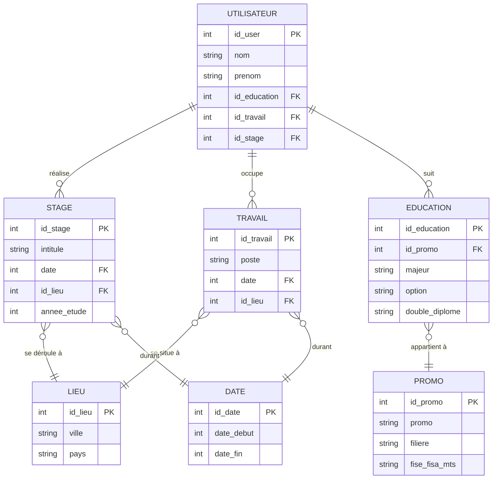

# Base de Données

---

## 1. Liste des informations


| Nom                     | Code      | Contrainte supplémentaires | Commentaires    |
|:------------------------|:----------|:---------------------------|:----------------|
| Nom Alumni              | nom       |                            |                 |
| Prénom Alumni           | prenom    |                            |                 |
| Intitullé poste         | poste     |                            |                 |
| Date Début              | debut     |                            |                 |
| Date fin                | fin       |                            |                 |
| Ville                   | ville     |                            |                 |
| Pays                    | pays      |                            |                 |
| Majeur                  | majeur    |                            |                 |
| Option                  | option    |                            |                 |
| Intitulé double diplôme | ddiplome  |                            |                 |
| Intitullé poste         | poste     |                            |                 |
| Promo                   | promo     |                            |                 |
| Filière                 | filiere   |                            |                 |
| Formation               | formation |                            | FISE, FISA, MTS |
| Option                  | option    |                            |                 |
| Option                  | option    |                            |                 |
| Intitullé stage         | stage     |                            |                 |
| Année stage             | annee     |                            |                 |




```
