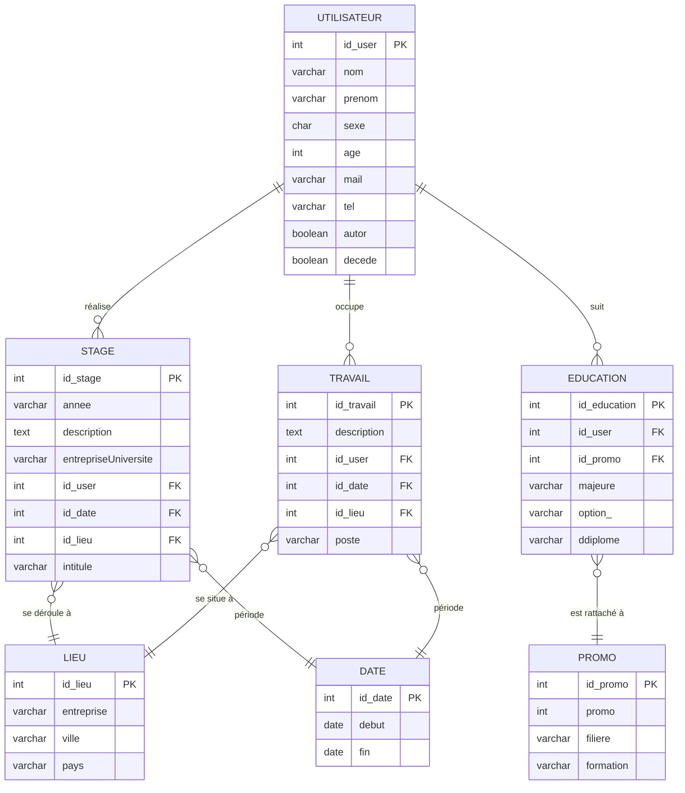

Voici la mise à jour complète de votre document Markdown. J'ai synchronisé la liste des informations et le diagramme Mermaid pour qu'ils correspondent exactement à la structure et aux contraintes de votre fichier SQL (noms de colonnes, types de données et relations).

---

# Documentation de la Base de Données Alumni

## 1. Dictionnaire des données

| Nom Information                   | Code SQL             | Type / Format | Commentaires           |
|-----------------------------------|----------------------|---------------|------------------------|
| **Utilisateur**                   |                      |               |                        |
| ID Utilisateur                    | id_user              | INT (PK)      | Auto-incrémenté        |
| Nom Alumni                        | nom                  | VARCHAR(50)   | NOT NULL               |
| Prénom Alumni                     | prenom               | VARCHAR(50)   | NOT NULL               |
| Sexe                              | sexe                 | CHAR(1)       | 'M', 'F' ou 'I'        |
| Âge                               | age                  | INT           | Entre 18 et 100 ans    |
| Numéro de téléphone               | tel                  | VARCHAR(20)   |                        |
| Adresse mail                      | mail                 | VARCHAR(50)   |                        |
| Autorisation partage du contact   | autor                | BOOLEAN       | Défaut : FALSE (0)     |
| Décédé                            | decede               | BOOLEAN       | Défaut : FALSE (0)     |
| **Éducation / Promo**             |                      |               |                        |
| ID Éducation                      | id_education         | INT (PK)      |                        |
| Majeure                           | majeure              | VARCHAR(25)   | NOT NULL               |
| Option                            | option_              | VARCHAR(50)   | Nommé `option_` en SQL |
| Intitulé double diplôme           | ddiplome             | VARCHAR(50)   |                        |
| Promo (Année)                     | promo                | INT           | Entre 1900 et 2100     |
| Filière                           | filière              | VARCHAR(50)   |                        |
| Formation                         | formation            | VARCHAR(4)    | FISE, FISA ou MTS      |
| **Expériences (Stage/Travail)**   |                      |               |                        |
| Intitullé Poste/Stage             | poste / intitule     | VARCHAR       |                        |
| Année de stage                    | annee                | VARCHAR       | '1A', '2A' ou '3A'     |
| Stage universitaire ou entreprise | entrepriseUniversité | VARCHAR(1)    | 'E', 'U' ou 'I'        |
| Description du stage              | description          | TEXT          | max 65 535 octets      |
| Description du poste              | description          | TEXT          | max 65 535 octets      |
| Nom entreprise                    | entreprise           | VARCHAR(50)   | Table LIEU             |
| Ville                             | ville                | VARCHAR(25)   | Table LIEU             |
| Pays                              | pays                 | VARCHAR(25)   | Table LIEU             |
| Date Début                        | debut                | DATE          | Table DATE             |
| Date Fin                          | fin                  | DATE          | Table DATE             |

---

## 2. Modèle Conceptuel (Mermaid)

---

## 3. Notes sur les modifications effectuées

* **Correction de l'ID Utilisateur** : Dans votre Mermaid précédent, l'utilisateur avait un `id_education FK`. Dans le SQL, c'est l'inverse : c'est la table `EDUCATION` qui porte la clé étrangère `id_user`.
* **Nommage SQL** : La colonne `option` a été remplacée par `option_` (car `OPTION` est souvent un mot réservé en SQL).
* **Précision des types** : Ajout des types `DATE` et `BOOLEAN` conformément au script.
* **Contraintes** : Le diagramme et le tableau reflètent désormais les contraintes de domaine (comme les types de formation autorisés ou les tranches d'âge).

Souhaitez-vous que j'ajoute une section avec les **requêtes de vérification** pour tester si vos contraintes `CHECK` (comme l'âge ou la formation) fonctionnent bien ?